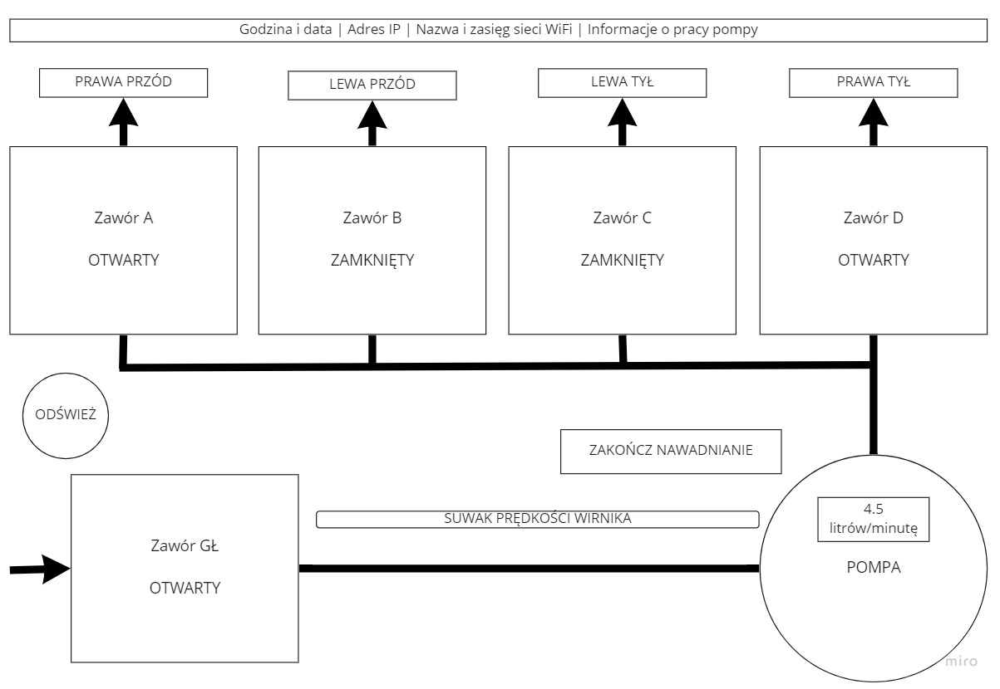

# Schemat ekranu sterownika 

Ekran będzie miał taki układ. Linie symbolizujące rury mogłyby animować przepływ wody podczas pracy pompy. Przycisk do odświeżenia może mieć ikonkę zamiast napisu.

Pasek na górze ekranu z datą, godziną itd. zostawmy na sam koniec - nie jest konieczny do działania sterownika. 